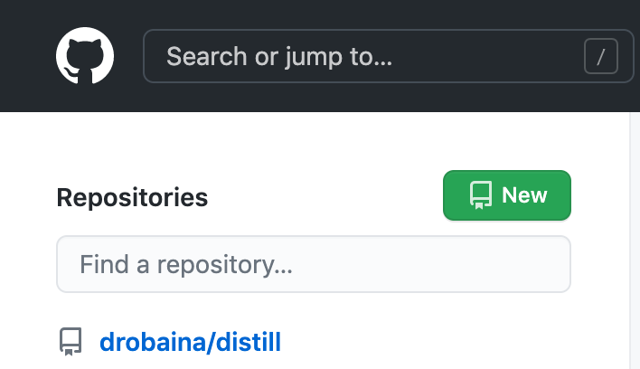
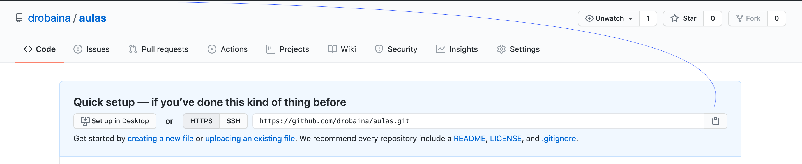
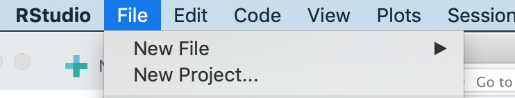
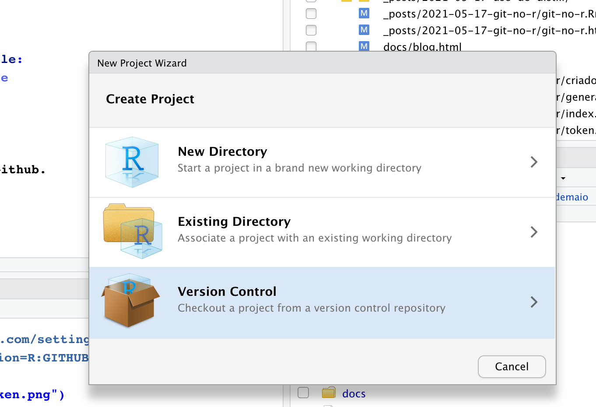
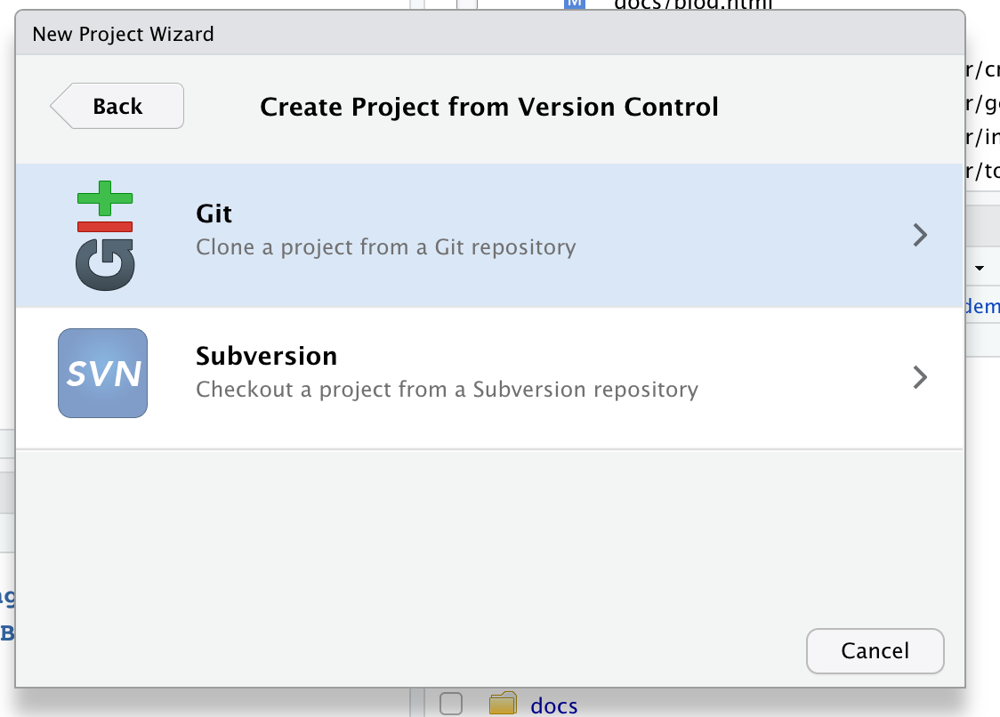
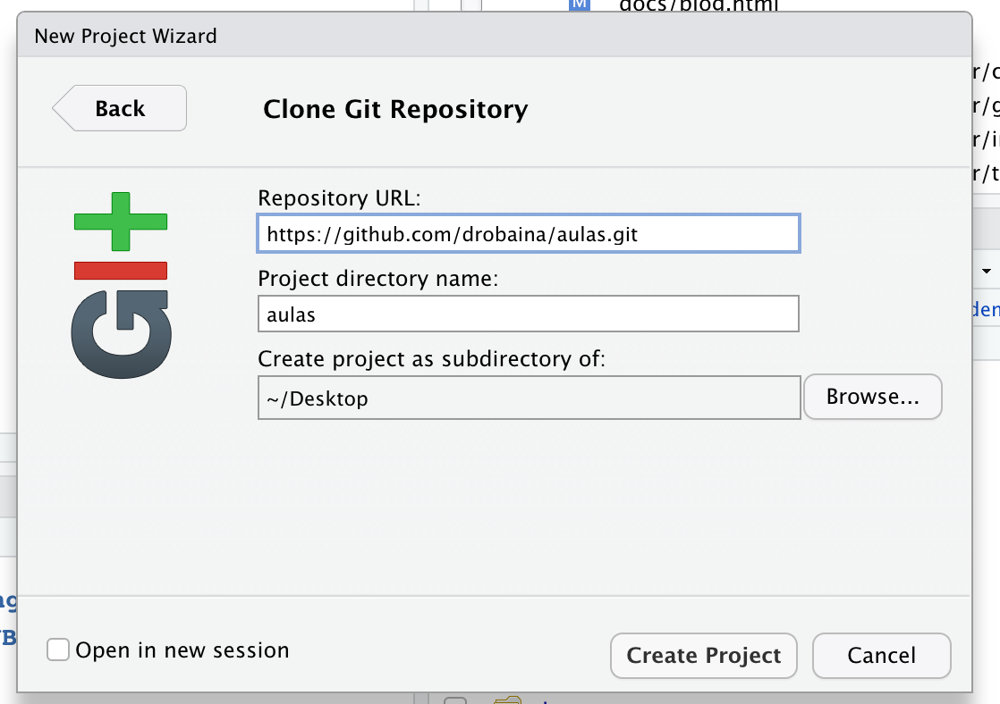

# Primeiro passo

Criar o repositório no Github.

<center>
```{r echo=FALSE, out.width = '50%'}

```
</center>


# Segundo passo

Copiar o nome do repositório criado
<center>
```{r echo=FALSE, out.width = '50%'}

```
</center>

# Terceiro Passo

Ir no RStudio e criar um novo projeto
<center>
```{r echo=FALSE, out.width = '50%'}

```
</center>

Marcar o projeto como versão de controle

<center>
```{r echo=FALSE, out.width = '50%'}

```
</center>

Acionar o GIT 

<center>
```{r echo=FALSE, out.width = '50%'}

```
</center>

E depois colar o nome do diretório criado no Github

<center>
```{r echo=FALSE, out.width = '50%'}

```
</center>


# Segundo Passo - outra opção

Criar direto no console - sem ter que abrir o Github novamente

```
usethis::create_project("aulas2") 
```

Depois "chame" o GIT

````
usethis::use_git()
````

Clique o número referente ao 


#### Yeah - Absolutely 

Depois reiniciar

#### For sure

Agora "chame" o Github

```
usethis::use_github()
```

Marque que não tem o ssh e para criar o repositório


# Segundo Passo - mais uma opção

Você já possui um repositório e que incrementá-lo?

Então utilize a função

```
usethis::create_from_github()
```

### Atenção 

`repo_spec` = repositório que quer trabalhar. Deve estar no formato: "usuario_github/repositorio".


`destdir` = diretório onde os arquivos serão salvos.


`fork = TRUE`, irá fazer o fork do repositório. Só funcionará se o token do GitHub foi configurado corretamente


